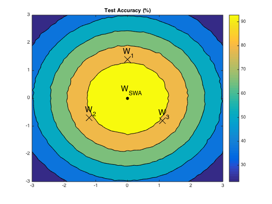

# SWA Object Detection

This project hosts the scripts for training SWA object detectors, as presented in our paper:

```
@article{zhang2020swa,
  title={SWA Object Detection},
  author={Zhang, Haoyang and Wang, Ying and Dayoub, Feras and S{\"u}nderhauf, Niko},
  journal={arXiv preprint arXiv:2012.12645},
  year={2020}
}
```
The full paper is available at: [https://arxiv.org/abs/2012.12645](https://arxiv.org/abs/2012.12645).

## Introduction
Do you want to improve 1.0 AP for your object detector without any inference cost and any change to your detector? Let us tell you such a recipe. It is surprisingly simple: **train your detector for an extra 12 epochs using cyclical learning rates and then average these 12 checkpoints as your final detection model**. This potent recipe is inspired by Stochastic Weights Averaging (**SWA**), which is proposed in [1] for improving generalization in deep neural networks. We found it also very effective in object detection. In this work, we systematically investigate the effects of applying SWA to object detection as well as instance segmentation. Through extensive experiments, we discover a good policy of performing SWA in object detection, and we consistently achieve ~1.0 AP improvement over various popular detectors on the challenging COCO benchmark. We hope this work will make more researchers in object detection know this technique and help them train better object detectors.


<div align="center">
  
  <p>SWA Object Detection: averaging multiple detection models leads to a better one.</p>
</div>


## Updates
- **2020.12.24** Release the code.


## Installation
- This project is based on [MMDetection](https://github.com/open-mmlab/mmdetection). Therefore the installation is the same as original MMDetection.

- Please check [get_started.md](docs/get_started.md) for installation. Note that you should change the version of PyTorch and CUDA to yours when installing **mmcv** in `step 3` and clone this repo instead of MMdetection in `step 4`.

- If you run into problems with `pycocotools`, please install it by:

  ```
  pip install "git+https://github.com/open-mmlab/cocoapi.git#subdirectory=pycocotools"
  ```

## Usage of MMDetection
MMDetection provides [colab tutorial](demo/MMDet_Tutorial.ipynb), and full guidance for quick run [with existing dataset](docs/1_exist_data_model.md) and [with new dataset](docs/2_new_data_model.md) for beginners.
There are also tutorials for [finetuning models](docs/tutorials/finetune.md), [adding new dataset](docs/tutorials/new_dataset.md), [designing data pipeline](docs/tutorials/data_pipeline.md), [customizing models](docs/tutorials/customize_models.md), [customizing runtime settings](docs/tutorials/customize_runtime.md) and [useful tools](docs/useful_tools.md).

Please refer to [FAQ](docs/faq.md) for frequently asked questions.


## Getting Started
In this project, we mainly provide config files and helper scripts for training SWA object detectors. The config files are located in the [configs/swa directory](configs/swa) and the helper scripts in the [swa directory](swa).

We take training SWA Mask RCNN as an example to describe how to train an SWA object detector as well as evaluate it.
- Download the [pre-trained MaskRCNN-R101-2x-0.02-0.0002-40.8-36.6](http://download.openmmlab.com/mmdetection/v2.0/mask_rcnn/mask_rcnn_r101_fpn_2x_coco/mask_rcnn_r101_fpn_2x_coco_bbox_mAP-0.408__segm_mAP-0.366_20200505_071027-14b391c7.pth) from [Mask RCNN Model Zoo](configs/mask_rcnn/README.md) into the [checkpoints directory](checkpoints/mask_rcnn). This model achieves 40.8 bbox AP and 36.6 mask AP on the COCO val2017.

- Run the command below to start the training with the config file [swa_mask_rcnn_r101_fpn_2x_coco.py](configs/swa/swa_mask_rcnn_r101_fpn_2x_coco.py)
  ```
  ./tools/dist_train.sh configs/swa/swa_mask_rcnn_r101_fpn_2x_coco.py 8 --cfg-options load_from=checkpoints/mask_rcnn/mask_rcnn_r101_fpn_2x_coco_bbox_mAP-0.408__segm_mAP-0.366_20200505_071027-14b391c7.pth work_dir=work_dirs/swa_mask_rcnn_r101_fpn_2x_coco

  ```
  In this config file, we use the cyclical learning rate schedule for training. We set the upper bound of cyclical learning rates as the initial learning rate of the pre-trained model, i.e. 1x0.02 in this case, and the lower bound as 0.01x0.02 = 0.0002, through configuring `target_ratio=(1, 0.01)`. The cycle length is 1 epoch as `cyclic_times=24` for total 24 epochs.  This training starts from the previously downloaded pre-trained model and checkpoints are saved in `work_dirs/swa_mask_rcnn_r101_fpn_2x_coco`.

- When the training is finished, run the script [get_swa_model.py](swa/get_swa_model.py) to get the final SWA model.
  ```
  ./swa/get_swa_model.py work_dirs/swa_mask_rcnn_r101_fpn_2x_coco 1 12 --save_dir work_dirs/swa_mask_rcnn

  ```

  The average model swa_1-12.pth will be saved in `work_dirs/swa_mask_rcnn`.

- Finally, evaluate the SWA model on the COCO val2017:
  ```
  ./tools/test.py configs/swa/swa_mask_rcnn_r101_fpn_2x_coco.py work_dirs/swa_mask_rcnn/swa_1-12.pth --eval bbox segm

  ```
  You are likely to get the result of 41.7 bbox AP and 37.4 mask AP, which are higher than the performance of the original model by 0.9 bbox AP and 0.8 mask AP respectively.

If you would like to train other SWA object detectors, you only need to download related pre-trained models and follow the steps above with making corresponding changes to the commands. If you are interested in training an SWA object detector from scratch, please refer to the last paragraph of Section 3.1 in our paper.


## Results and Models
For your convenience, we provide the following SWA models. These models are obtained by averaging checkpoints that are trained with cyclical learning rates for 12 epochs.


| Model                                             | bbox AP (val)     | segm AP  (val)      | &nbsp; &nbsp; Download  &nbsp; &nbsp;  |
|:-------------------------------------------------:|:-----------------:|:-------------------:|:--------------------------------------:|
| SWA-MaskRCNN-R50-1x-0.02-0.0002-38.2-34.7         | 39.1, +0.9        | 35.5, +0.8          | [model](https://drive.google.com/file/d/1Pue5dYW_JkQXwRQmBSeSX6cVluVBQYFB/view?usp=sharing) &#124; [config](configs/swa/swa_mask_rcnn_r50_fpn_1x_coco.py) |
| SWA-MaskRCNN-R101-1x-0.02-0.0002-40.0-36.1        | 41.0, +1.0        | 37.0, +0.9          | [model](https://drive.google.com/file/d/1_qAfKqs4aNND_IjWUMyirV7e9MVpFiHy/view?usp=sharing) &#124; [config](configs/swa/swa_mask_rcnn_r101_fpn_1x_coco.py) |
| SWA-MaskRCNN-R101-2x-0.02-0.0002-40.8-36.6        | 41.7, +0.9        | 37.4, +0.8          | [model](https://drive.google.com/file/d/1i1NjfU9F-GdUBc-nRcJ60Ap1BfS-avyH/view?usp=sharing) &#124; [config](configs/swa/swa_mask_rcnn_r101_fpn_2x_coco.py) |
| SWA-FasterRCNN-R50-1x-0.02-0.0002-37.4            | 38.4, +1.0        | -                   | [model](https://drive.google.com/file/d/1wbPDsas-nmBvctsebGa05I33-iP2kCyV/view?usp=sharing) &#124; [config](configs/swa/swa_faster_rcnn_r50_fpn_1x_coco.py) |
| SWA-FasterRCNN-R101-1x-0.02-0.0002-39.4           | 40.3, +0.9        | -                   | [model](https://drive.google.com/file/d/112CzQ5nCTz_RkDSkGdbCT3pmu3ajsvxT/view?usp=sharing) &#124; [config](configs/swa/swa_faster_rcnn_r101_fpn_1x_coco.py) |
| SWA-FasterRCNN-R101-2x-0.02-0.0002-39.8           | 40.7, +0.9        | -                   | [model](https://drive.google.com/file/d/1hTS5cVebeDaC16W3laRvAtog5a3ZPFZF/view?usp=sharing) &#124; [config](configs/swa/swa_faster_rcnn_r101_fpn_2x_coco.py) |
| SWA-RetinaNet-R50-1x-0.01-0.0001-36.5             | 37.8, +1.3        | -                   | [model](https://drive.google.com/file/d/1IYVpS6AsfXzwTM80P2ZaWS-u1FXa63Xd/view?usp=sharing) &#124; [config](configs/swa/swa_retinanet_r50_fpn_1x_coco.py) |
| SWA-RetinaNet-R101-1x-0.01-0.0001-38.5            | 39.7, +1.2        | -                   | [model](https://drive.google.com/file/d/1UMLmqwJ29DFOr52JJp_sTD5Tx5nzmFO2/view?usp=sharing) &#124; [config](configs/swa/swa_retinanet_r101_fpn_1x_coco.py) |
| SWA-RetinaNet-R101-2x-0.01-0.0001-38.9            | 40.0, +1.1        | -                   | [model](https://drive.google.com/file/d/11Z4Vnm8175WM6xy-0qu_1KPhoWAEPhH8/view?usp=sharing) &#124; [config](configs/swa/swa_retinanet_r101_fpn_2x_coco.py) |
| SWA-FCOS-R50-1x-0.01-0.0001-36.6                  | 38.0, +1.4        | -                   | [model](https://drive.google.com/file/d/1xgxXYYT3p-Azv5PnXMrPAKBtN1VhvBWz/view?usp=sharing) &#124; [config](configs/swa/swa_fcos_r50_caffe_fpn_4x4_1x_coco.py) |
| SWA-FCOS-R101-1x-0.01-0.0001-39.2                 | 40.3, +1.1        | -                   | [model](https://drive.google.com/file/d/1GYx79UpPaL321Va0jSZ4DDWkms00pMs0/view?usp=sharing) &#124; [config](configs/swa/swa_fcos_r101_caffe_fpn_gn-head_4x4_1x_coco.py) |
| SWA-FCOS-R101-2x-0.01-0.0001-39.1                 | 40.2, +1.1        | -                   | [model](https://drive.google.com/file/d/1yiyeXSkuFMq0FVvrjJkcN72etd1p3gKp/view?usp=sharing) &#124; [config](configs/swa/swa_fcos_r101_caffe_fpn_gn-head_4x4_2x_coco.py) |
| SWA-YOLOv3(320)-D53-273e-0.001-0.00001-27.9       | 28.7, +0.8        | -                   | [model](https://drive.google.com/file/d/1pZS52yHoQVh6kybV9D83bvzsSIN_wFvh/view?usp=sharing) &#124; [config](configs/swa/swa_yolov3_d53_320_273e_coco.py) |
| SWA-YOLOv3(680)-D53-273e-0.001-0.00001-33.4       | 34.2, +0.8        | -                   | [model](https://drive.google.com/file/d/1FQd0oWsk18VKUv40ywtYe4G0SiYpqKZ7/view?usp=sharing) &#124; [config](configs/swa/swa_yolov3_d53_mstrain-608_273e_coco.py) |
| SWA-VFNet-R50-1x-0.01-0.0001-41.6                 | 42.8, +1.2        | -                   | [model](https://drive.google.com/file/d/15nRdpQqjiCzuvLYytdJg86g9x4tQ8cCo/view?usp=sharing) &#124; [config](configs/swa/swa_vfnet_r50_fpn_1x_coco.py) |
| SWA-VFNet-R101-1x-0.01-0.0001-43.0                | 44.3, +1.3        | -                   | [model](https://drive.google.com/file/d/13tGeJBqzS1ITAaESMMDAaEHMrSJvA0g2/view?usp=sharing) &#124; [config](configs/swa/swa_vfnet_r101_fpn_1x_coco.py) |
| SWA-VFNet-R101-2x-0.01-0.0001-43.5                | 44.5, +1.0        | -                   | [model](https://drive.google.com/file/d/1rJm0tcxWIjCDl6Np7MPR3OE6mwUDWwh0/view?usp=sharing) &#124; [config](configs/swa/swa_vfnet_r101_fpn_2x_coco.py) |


**Notes:**
- SWA-MaskRCNN-R50-1x-0.02-0.0002-38.2-34.7 means this SWA model is produced based on the pre-trained Mask RCNN model that has a ResNet50 backbone, is trained under 1x schedule with the initial learning rate 0.02 and ending learning rate 0.0002, and achieves 38.2 bbox AP and 34.7 mask AP on the COCO val2017 respectively. This SWA model acheives 39.1 bbox AP and 35.5 mask AP, which are higher than the pre-trained model by 0.9 bbox AP and 0.8 mask AP respectively. This rule applies to other object detectors.

- In addition to these baseline detectors, SWA can also improve more powerful detectors. One example is [VFNetX](https://github.com/hyz-xmaster/VarifocalNet#vfnetx) whose performance on the COCO val2017 is improved from 52.2 AP to 53.4 AP (+1.2 AP).

- More detailed results including AP<sub>50</sub> and AP<sub>75</sub> can be found [here](configs/swa/README.md).

## Contributing
Any pull requests or issues are welcome.


## Citation
Please consider citing our paper in your publications if the project helps your research. BibTeX reference is as follows:
```
@article{zhang2020swa,
  title={SWA Object Detection},
  author={Zhang, Haoyang and Wang, Ying and Dayoub, Feras and S{\"u}nderhauf, Niko},
  journal={arXiv preprint arXiv:2012.12645},
  year={2020}
}
```

# Acknowledgment
Many thanks to [Dr Marlies Hankel](https://aibn.uq.edu.au/profile/2882/marlies-hankel) and [MASSIVE HPC](https://www.massive.org.au/) for supporting precious GPU computation resources!

We also would like to thank MMDetection team for producing this great object detection toolbox.

## License
This project is released under the [Apache 2.0 license](LICENSE).

## References
[1] Averaging Weights Leads to Wider Optima and Better Generalization; Pavel Izmailov, Dmitry Podoprikhin, Timur Garipov, Dmitry Vetrov, Andrew Gordon Wilson; Uncertainty in Artificial Intelligence (UAI), 2018
